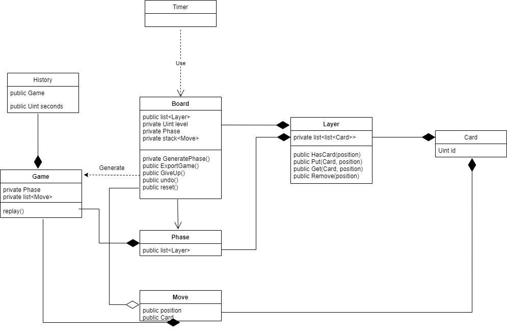

# Oarrange

Oarrange是一个启发于当前热门小游戏 羊了个羊 的移动端游戏。游戏机制几乎没有任何改动，只是尝试修复了一些 羊了个羊 令人诟病的缺点，提升玩家体验。

## This game is still being built...

## 项目需求

- 功能性需求

    1. **难度层级**：游戏必须遵循先易后难的顺序，并且每两关之间的难度差别不能太大。
  
       *解决方案*：因为大致上游戏难度和卡片总数量是正面关系，所以难度约等于卡片总量。那么我们就固定每一关的卡片数量并慢慢递增就行。

    2. **解的存在性**：任何一个关卡都不能无解。并且关卡内容最好不是固定的（随机生成关卡）。
  
       *解决方案*：用逆推方法生成关卡。保持同一种牌的第一张和第三张之间的距离小于7。

    3. **支持查看游玩历史**：让玩家可以记录自己的成绩，重新观看回放。
  
       *解决方案*：记录玩家的通关时间，初始棋盘和每一步的选项。回放时自动从初始棋盘开始再生所有选项。

- 非功能性需求

    1. **计时器功能**：为关卡加上时间限制。玩家必须看得见剩余时间。
  
       *解决方案*：第一步：放一个倒计时钟表。第二步：倒计时归零时显示“Game Over”。

    2. **悔棋（undo）、重置（reset）**：让玩家“回到上一步”（可以多次调用）或“重新开始”（计时器不重置）。
  
        *解决方案*：这个涉及实现方法，需要后期讨论。

- 特殊需求

    1. **无后端**：暂时不考虑后端支持，前端需要完成存储读取操作。

## 项目结构（类图）

*注释*：

- Card：卡片类。目前只需要有一个id，不同id代表不同的卡片。
- Layer：卡层类。一个卡层代表卡片堆叠的某一层，每一个卡层都有两个坐标（x, y），每一个坐标代表一个摆放卡片的位置。
- Board：棋盘类。棋盘包含自下至上的几个卡层，根据玩家的操作，棋盘会对相应卡层做出操作。
- Phase：关卡类。存储关卡开始时的棋盘状态。
- Game：游戏类。存储一个Phase类以及玩家完成这个Phase所做的全部动作。
- History：历史类。存储Game类和玩家完成这局Game所用的时间。
- Timer：计时器类。在倒计时结束后自动调用Board的放弃选项。
- Move：动作类。表示玩家的一个操作，只需要包含被操作的卡片以及操作的位置。